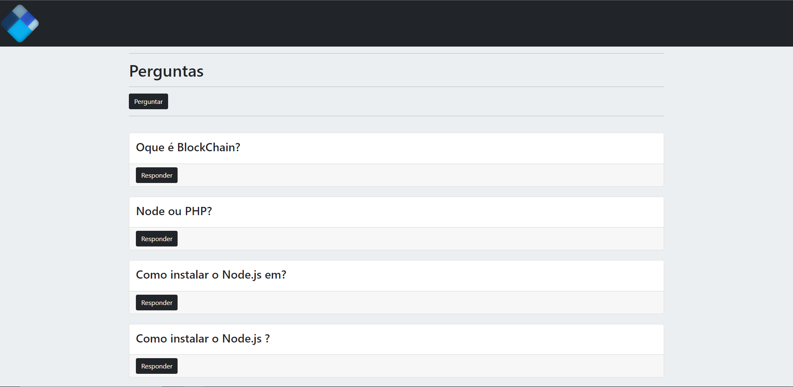
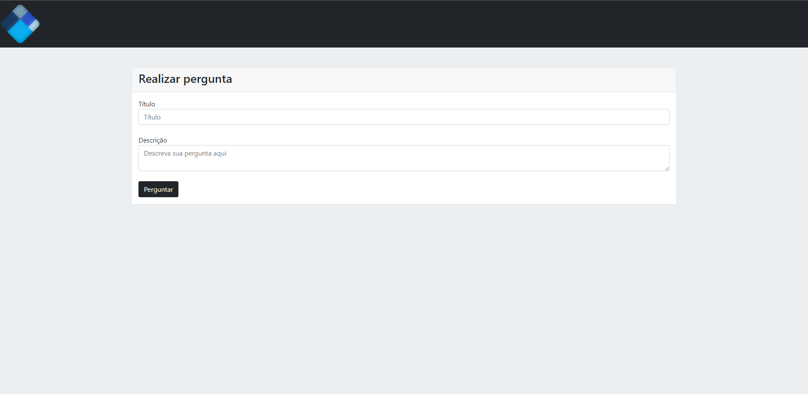
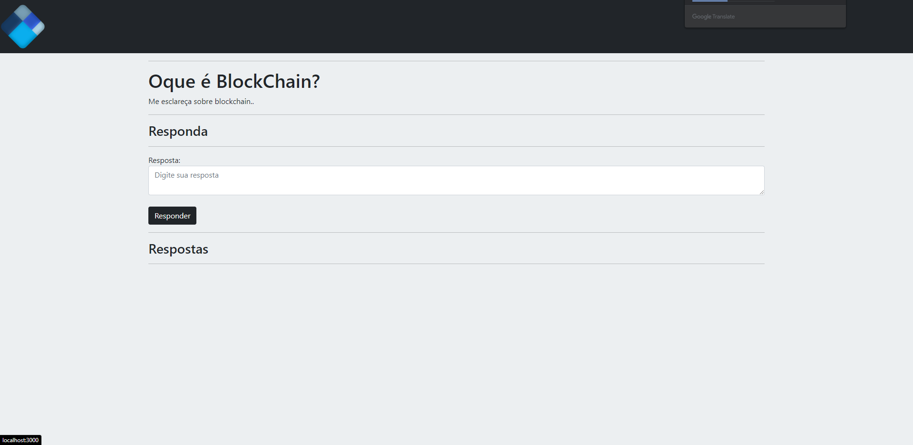
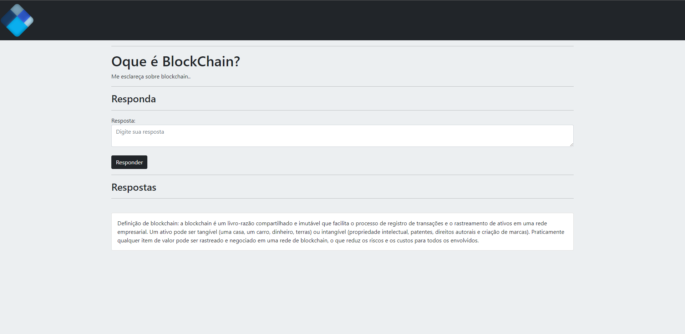

## Perguntas
 
  
 

## Realizar perguntas
 
  
 

## Pergunta Anônima

  
 

## Respostas Anônimas

 

<h1>Site Perguntas e Resposta</h1>

## 🛠️ Tecnologias

As seguintes ferramentas foram usadas na construção do projeto:
 * 
 * 
 *  
 *  
 *  
 *  
  

### Features

- [x] Realizar uma Pergunta
- [x] Responder uma Pergunta
- [x] Exibir respostas feitas

